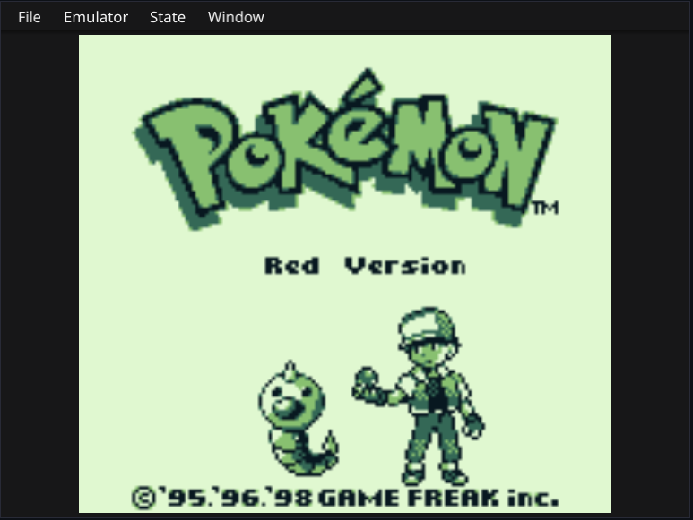

# Gameboy emulator written in go

Well, it runs pokemon red



## Default keymap
```
Up     -> W  
Right  -> A  
Down   -> S  
Left   -> D  
A      -> X  
B      -> C  
Start  -> Enter  
Select -> Space  
```

## Usage
```
make build
./build/gb-emu
```

## Limitations
- Currently only supports games using MBC1/3
- Battery save does not work so you need to use save states

## TODO (Emulation)
- [x] Bank switching
- [x] allow multiple state slots
- [x] auto save state
- [x] fix screen flicker
- [ ] Sound
- [ ] Window scroll (still work to do)

## TODO (User Interface)
- [ ] file menu
    - [x] load rom
    - [x] save state
    - [x] load state
    - [ ] pause emulation when a menu is open
    - [ ] prompt for state override?
    - [x] remap key binds
- [ ] debug windows
    - [ ] tile maps
    - [ ] Cpu registers
    - [ ] Input

